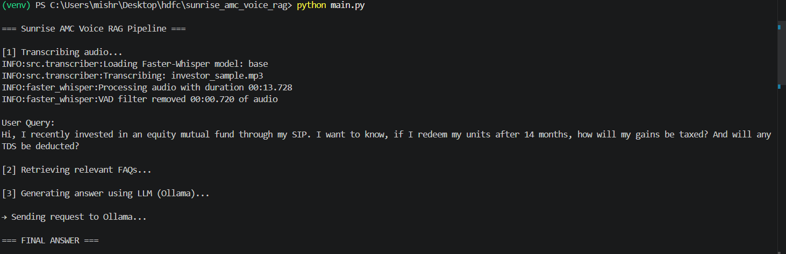

# 🎙️ Sunrise AMC — Voice-Powered Investor Support Assistant

> A fully **offline, open-source RAG pipeline** that lets investors ask questions by voice and receive grounded, cited answers from a financial FAQ knowledge base — no paid APIs, no cloud dependencies.

[](https://www.python.org/)
[](https://ollama.com/)
[](https://www.trychroma.com/)
[](https://github.com/guillaumekln/faster-whisper)
[](LICENSE)

---

## Table of Contents

- [Overview](#overview)
- [System Architecture](#system-architecture)
- [Pipeline Flow](#pipeline-flow)
- [Project Structure](#project-structure)
- [Tech Stack](#tech-stack)
- [Setup & Installation](#setup--installation)
- [Running the Pipeline](#running-the-pipeline)
- [Output Reference](#output-reference)
- [Design Decisions](#design-decisions)
- [Limitations & Future Work](#limitations--future-work)
- [Compliance](#compliance)

---

## Overview

Sunrise AMC's investor support team receives hundreds of repetitive queries about fund performance, redemption timelines, NAV calculations, and compliance. This system automates first-line support by:

1. **Transcribing** investor voice queries using Faster-Whisper
2. **Retrieving** the most relevant answers from an internal FAQ PDF
3. **Generating** grounded, cited responses via a local Llama 3 model

Everything runs on a standard developer machine — no OpenAI, no Google Cloud, no external services.

---

## System Architecture

```
┌─────────────────────────────────────────────────────────────────────┐
│                    SUNRISE AMC VOICE RAG SYSTEM                     │
│                                                                     │
│  ┌──────────────┐    ┌──────────────┐    ┌───────────────────────┐ │
│  │  VOICE INPUT │    │  KNOWLEDGE   │    │   ANSWER GENERATION   │ │
│  │              │    │     BASE     │    │                       │ │
│  │ investor_    │    │ SunriseAMC_  │    │   Llama 3 via Ollama  │ │
│  │ sample.mp3   │    │   FAQ.pdf    │    │   (local inference)   │ │
│  └──────┬───────┘    └──────┬───────┘    └───────────┬───────────┘ │
│         │                  │                         │             │
│         ▼                  ▼                         │             │
│  ┌──────────────┐    ┌──────────────┐                │             │
│  │ TRANSCRIBER  │    │  INGESTION   │                │             │
│  │              │    │              │                │             │
│  │Faster-Whisper│    │  PyMuPDF +   │                │             │
│  │  (base model)│    │Hybrid Chunker│                │             │
│  └──────┬───────┘    └──────┬───────┘                │             │
│         │                  │                         │             │
│         │                  ▼                         │             │
│         │           ┌──────────────┐                 │             │
│         │           │  VECTOR DB   │                 │             │
│         │           │              │                 │             │
│         │           │   ChromaDB   │                 │             │
│         │           │all-MiniLM-L6 │                 │             │
│         │           └──────┬───────┘                 │             │
│         │                  │                         │             │
│         ▼                  ▼                         │             │
│  ┌─────────────────────────────────┐                 │             │
│  │           RETRIEVER             │                 │             │
│  │                                 │                 │             │
│  │   query text → top-k FAQ chunks │─────────────────►             │
│  │   + citation metadata (Q#)      │                 │             │
│  └─────────────────────────────────┘                 │             │
│                                                      ▼             │
│                                          ┌───────────────────────┐ │
│                                          │   FINAL RESPONSE      │ │
│                                          │                       │ │
│                                          │ Grounded answer with  │ │
│                                          │ FAQ citation (e.g Q9) │ │
│                                          └───────────────────────┘ │
└─────────────────────────────────────────────────────────────────────┘
```

---

## Pipeline Flow

```
 Investor Voice Query
         │
         ▼
┌─────────────────────┐
│   1. TRANSCRIPTION  │  faster-whisper (base)
│                     │  → transcript text
│   investor.mp3      │  → word timestamps
│       ──►           │  → confidence scores
│   transcript.json   │
└──────────┬──────────┘
           │
           │  query text
           ▼
┌─────────────────────┐         ┌──────────────────────────┐
│   3. RETRIEVAL      │◄────────│   2. KNOWLEDGE INGESTION │
│                     │  stored │                          │
│  ChromaDB query     │  chunks │  SunriseAMC_FAQ.pdf       │
│  cosine similarity  │         │    └─► PyMuPDF extract    │
│  top-k results      │         │    └─► FAQ regex chunking │
│  + Q# metadata      │         │    └─► sliding window fb  │
└──────────┬──────────┘         │    └─► MiniLM embed       │
           │                    │    └─► ChromaDB store     │
           │  context chunks    └──────────────────────────┘
           ▼
┌─────────────────────┐
│  4. GENERATION      │  Llama 3 via Ollama
│                     │  System: "Answer only from context"
│  [query] + [chunks] │
│       ──►           │
│   grounded answer   │
│   + FAQ citations   │
└─────────────────────┘
```

---

## Project Structure

```
sunrise_amc_voice_rag/
│
├── main.py                     # End-to-end pipeline orchestrator
├── requirements.txt            # Python dependencies
├── README.md
├── DECISIONS.md                # Architectural decision log
│
├── src/
│   ├── transcriber.py          # Faster-Whisper speech-to-text
│   ├── ingestion.py            # PDF ingestion + embedding pipeline
│   ├── retriever.py            # ChromaDB vector retrieval
│   └── generator.py            # Ollama / Llama 3 answer generation
│
├── input/
│   ├── SunriseAMC_FAQ.pdf      # Knowledge base source
│   └── investor_sample.mp3     # Sample voice query
│
├── output/
│   └── transcript.json         # Whisper transcription output
│
├── eval/                       # Evaluation scripts
│
└── data/
    └── chroma_db/              # Persistent vector store (git-ignored)
```

---
## Demo (Terminal Output)

Below is a sample execution of the system:



## Tech Stack

| Layer | Component | Model / Version | Why |
|---|---|---|---|
| Speech-to-Text | [Faster-Whisper](https://github.com/guillaumekln/faster-whisper) | `base` | CPU-friendly, word timestamps |
| PDF Parsing | [PyMuPDF](https://pymupdf.readthedocs.io/) | latest | Accurate layout-aware extraction |
| Embeddings | [SentenceTransformers](https://sbert.net/) | `all-MiniLM-L6-v2` | Fast, lightweight semantic vectors |
| Vector Store | [ChromaDB](https://www.trychroma.com/) | persistent | Local, no-server, cosine similarity |
| LLM | [Llama 3](https://ollama.com/library/llama3) via [Ollama](https://ollama.com/) | `llama3` | Strong instruction-following, local |

---

## Setup & Installation

### Prerequisites

- Python 3.10+
- [Ollama](https://ollama.com/download) installed on your machine
- ~5 GB disk space for model weights

### 1. Clone the repository

```bash
git clone https://github.com/mishra-khushboo/sunrise_amc_voice_rag.git
cd sunrise_amc_voice_rag
```

### 2. Install Python dependencies

```bash
pip install -r requirements.txt
```

### 3. Pull the Llama 3 model

```bash
ollama pull llama3
```

### 4. Start the Ollama service

```bash
# In a separate terminal (keep running)
ollama serve
```

---

## Running the Pipeline

### Full end-to-end run

```bash
python main.py
```

This will:
1. Transcribe `input/investor_sample.mp3` → `output/transcript.json`
2. Ingest and embed `input/SunriseAMC_FAQ.pdf` into ChromaDB (first run only)
3. Retrieve the top-k matching FAQ chunks for the query
4. Generate a grounded answer with FAQ citations

### Module-level usage

```python
from src.transcriber import transcribe
from src.retriever import retrieve
from src.generator import generate

# Step 1: Transcribe
result = transcribe("input/investor_sample.mp3")
query = result["transcript"]

# Step 2: Retrieve
context_chunks = retrieve(query, top_k=3)

# Step 3: Generate
answer = generate(query, context_chunks)
print(answer)
```

---

## Output Reference

### `output/transcript.json`

```json
{
  "transcript": "What is the NAV calculation frequency for the growth fund?",
  "words": [
    { "word": "What", "start": 0.0, "end": 0.3, "confidence": 0.98 },
    ...
  ],
  "confidence": 0.96
}
```

### Retrieved Context (console)

```
[Retrieved FAQ Chunks]
─────────────────────────────────────────
Q9: NAV is calculated at the end of each business day using...
Q10: The growth fund follows daily NAV disclosure as per SEBI...
─────────────────────────────────────────
```

### Final Answer (console)

```
[Answer]
Based on the Sunrise AMC FAQ (Q9, Q10): The NAV for the growth fund is
calculated at the close of every business day. Investors can view the
latest NAV on the AMC website or AMFI portal by 11 PM IST.
```

---

## Design Decisions

### Hybrid Chunking Strategy

```
SunriseAMC_FAQ.pdf
        │
        ▼
┌───────────────────────┐
│  FAQ-aware regex pass │  Detects "Q1.", "Q2." patterns
│  (primary)            │  Groups Q+A pairs as semantic units
└───────────┬───────────┘
            │ fails / unstructured section?
            ▼
┌───────────────────────┐
│  Sliding window       │  400 chars, 80-char overlap
│  (fallback)           │  Ensures no content is dropped
└───────────────────────┘
```

This ensures reliable chunking whether the PDF is neatly structured or contains freeform financial text.

### Fully Offline Architecture

```
┌──────────────────────────────────────────────────┐
│               LOCAL MACHINE ONLY                 │
│                                                  │
│   faster-whisper  ──►  no Whisper API calls      │
│   all-MiniLM-L6   ──►  no OpenAI embeddings      │
│   ChromaDB        ──►  no Pinecone / Weaviate     │
│   Llama 3/Ollama  ──►  no GPT-4 / Claude API     │
│                                                  │
│   ✔ Zero data leaves the machine                 │
│   ✔ No API keys required                         │
│   ✔ Works air-gapped                             │
└──────────────────────────────────────────────────┘
```

---

## Limitations & Future Work

### Current Limitations

| Area | Limitation |
|---|---|
| Chunking | Character-based; may split mid-sentence in long paragraphs |
| Retrieval | No reranker — pure cosine similarity can miss nuanced matches |
| Latency | Ollama cold-start adds ~10–15s on first query (CPU-only) |
| Scale | No caching; repeated queries re-embed and re-retrieve |

### Roadmap

- [ ] **Token-based semantic chunking** — replace character splits with sentence-boundary-aware chunking
- [ ] **Cross-encoder reranker** — add a second-pass ranking model (e.g. `ms-marco-MiniLM`) to improve retrieval precision
- [ ] **Query cache** — Redis or in-memory LRU cache for repeated investor queries
- [ ] **GPU inference** — vLLM or llama.cpp for 5–10× faster generation
- [ ] **Evaluation harness** — RAGAS or custom scorer for retrieval accuracy + answer faithfulness
- [ ] **Streaming output** — surface partial answers token-by-token for better UX

---

## Compliance

| Requirement | Status |
|---|---|
| Fully open-source stack | ✅ |
| No paid APIs used | ✅ |
| Runs locally on developer machine | ✅ |
| ChromaDB + model weights git-ignored | ✅ |
| Investor data never leaves local machine | ✅ |

---

## Author

Built by [@mishra-khushboo](https://github.com/mishra-khushboo) as a **production-inspired prototype** prioritising:
- **Reproducibility** — deterministic pipeline, no external state
- **Offline execution** — suitable for regulated financial environments
- **Modular architecture** — each stage is independently testable
- **Explainability** — citations link every answer back to a source FAQ entry


